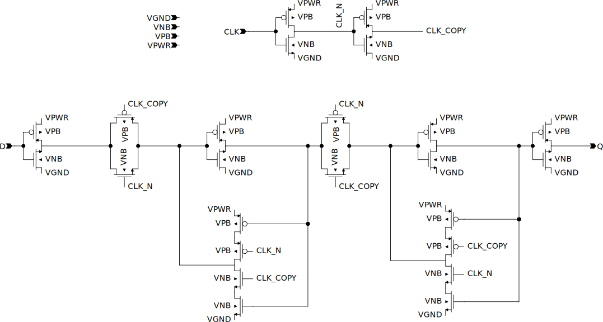

# SKY130 Schematics

This repository compiles verified visual schematics for all SKY130 High-Density Digital Standard Cells. Each schematic is validated with Layout Versus Schematic (LVS), ensuring 100% accuracy with the official SKY130 cells.

The official SKY130 cells can be found here:
<https://github.com/efabless/skywater-pdk-libs-sky130_fd_sc_hd/tree/master/cells>

Automatically generated schematics are published here:
<https://github.com/sifferman/sky130_schematics/releases/latest>

See the progress [here](https://github.com/sifferman/sky130_schematics/releases/latest/download/progress.svg).

## Contributing

Follow these steps to contribute a new schematic:

0. **Install Required Tools**
   * Follow the tool installation steps from the GitHub workflow file: <https://github.com/sifferman/sky130_schematics/blob/main/.github/workflows/push.yml>.
   * Note that you should probably clone all required repos to a `"~/GitHub"` directory, and install your tools to a `"~/tools"` directory.

1. **Set Up Your Branch**
   * Clone this repository and ensure your local `main` branch is up to date.
   * Create a new branch off `main` for your work.

2. **Claim a Cell**
   * Choose a cell to implement and create a GitHub Issue to claim it: <https://github.com/sifferman/sky130_schematics/issues>

3. **Prepare Your Schematic File**
   * Mirror the official SKY130 cell's path and filename in this repository.
     Example:
     * Official SPICE file: [`sky130_fd_sc_hd/cells/or2/sky130_fd_sc_hd__or2_0.spice`](https://github.com/efabless/skywater-pdk-libs-sky130_fd_sc_hd/blob/master/cells/or2/sky130_fd_sc_hd__or2_0.spice)
     * Your schematic file: [`schematics/or2/sky130_fd_sc_hd__or2_0.sch`](https://github.com/sifferman/sky130_schematics/blob/main/schematics/or2/sky130_fd_sc_hd__or2_0.sch)
   * This naming consistency is required for LVS checks.

4. **Start with a Template (Optional)**
   * Copy an existing schematic into your new file to use as a starting point.

5. **Edit in xschem**
   * Open `xschem` from the root directory of this project to ensure the provided [`xschemrc`](https://github.com/sifferman/sky130_schematics/blob/main/xschemrc) file is loaded.

6. **Create the Schematic**
   * Design the schematic in `xschem` based on the SPICE model for your chosen cell.
   * You can use these auto-generated schematics for guidance, but note that their quality varies: <https://github.com/sifferman/sky130_netlistsvg/releases/latest>.

7. **Verify with LVS**
   * Run `` make all_lvs -j`nproc` `` to check your schematic.
   * If it passes, your schematic matches the official SKY130 SPICE model.
   * If it fails, review the report in `"lvs/**/*.failed"` for debugging.

8. **Polish the Design**
   * Clean up your schematic to make it readable, symmetrical, and aesthetically consistent.
   * Please check the existing schematics as reference.
   * You can see the generated SVG by running `` make all_svg -j`nproc` ``.

9. **Submit a Pull Request**
   * Once your schematic passes LVS, submit a pull request for review.
   * Feedback will be provided to further refine your design.

---

### Note on LVS
**LVS (Layout Versus Schematic)** is typically used to verify that a silicon layout matches a circuit schematic. In this project, we use LVS to ensure the schematic aligns with the official SKY130 SPICE model.
